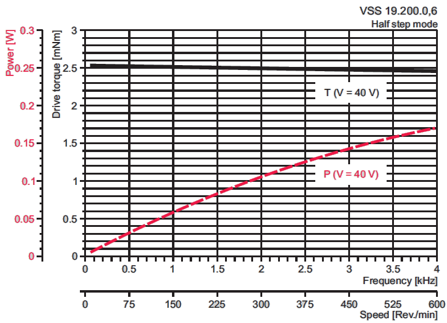

# Driver-StepperMotor
A driver of the precise stepper motor

#工作模式
  驱动机构各挡板围绕中心点做-10°到60°往返运动，每隔0.1度，后端电路会同步采集一次传感器压力信号。电机会在起点和重点发出同步脉冲，脉冲宽度为1ms
，高度为3.3V，分别检测起点脉冲上升沿和终点脉冲上升沿，作为+60°和-10°的采集传感器的同步时钟。
 

#参数考虑
##精度
    挡板运动速度（度/秒）：10
    角度分辨率（度）：0.1
##步进电机
    全步數 (步)	200
    全步角度 (度)	1.8
    設計步進率(步/秒)	5.5556 
    微步	32
    微角度 (微步)	0.0563 
    設計微步率(微步/秒)	177.7778 
##绝对编码器
    位數	12
    角度分辨率 (度/位)	0.087891 
    設計采樣率(樣品/秒)	1k
##运动机构扭矩曲线

##原理设计图

附：原理图、PCB和电机驱动程序
